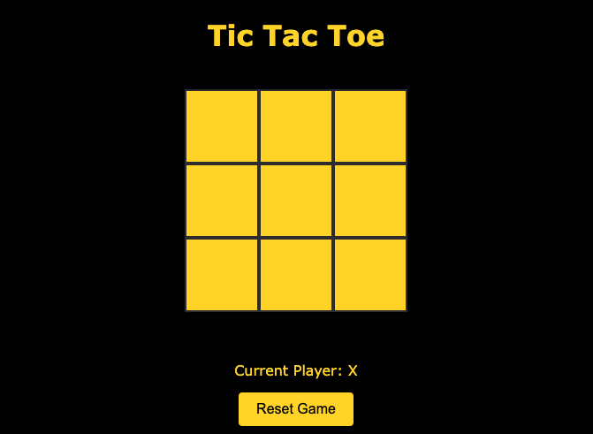

# Vue Project: Tic Tac Toe
Application for playing Tic Tac Toe Game, developed as the final project of the Vue course in Start2Impact. 

## How it works
The user accesses the page and will find the 3x3 grid where to play Tic Tac Toe. Each square of the grid if clicked will show the O or the X, the first click is always the X, the second an O, and so on until one of the player wins the game or nobody wins resulting in a draw.

## App Link
[Click here to launch the App](dist/index.html)

## Screenshots

## License
[MIT](https://choosealicense.com/licenses/mit/)

## Author
- [@RaffaeleBini](https://www.github.com/RaffaeleBini)

## 🔗 Links

## Feedback

If you have any feedback, please reach out to me at www.raffaelebini.com#6
